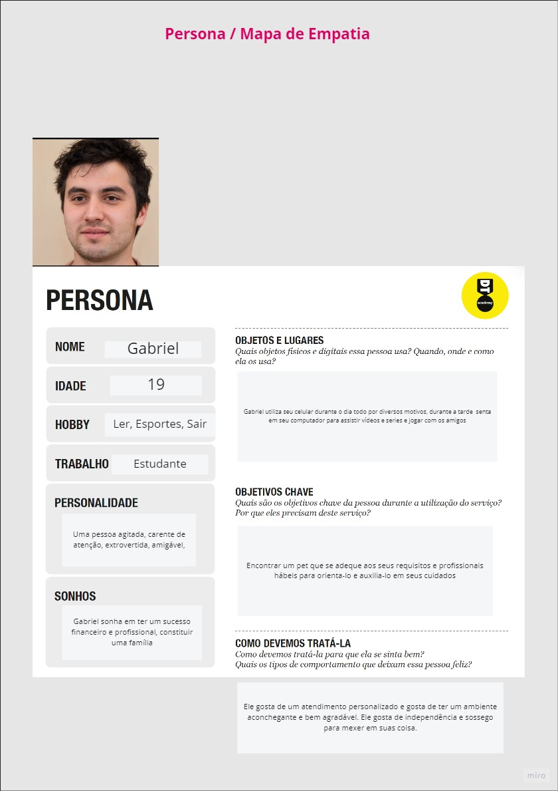
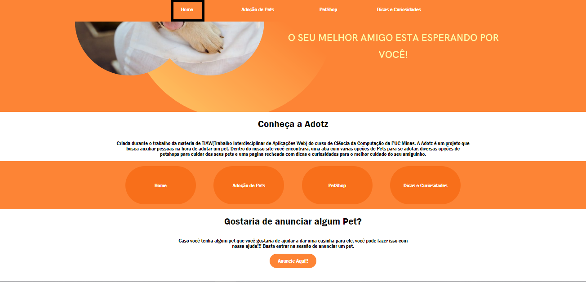
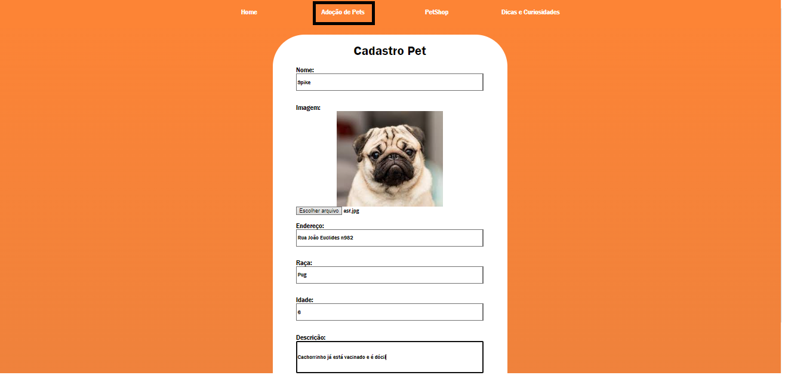
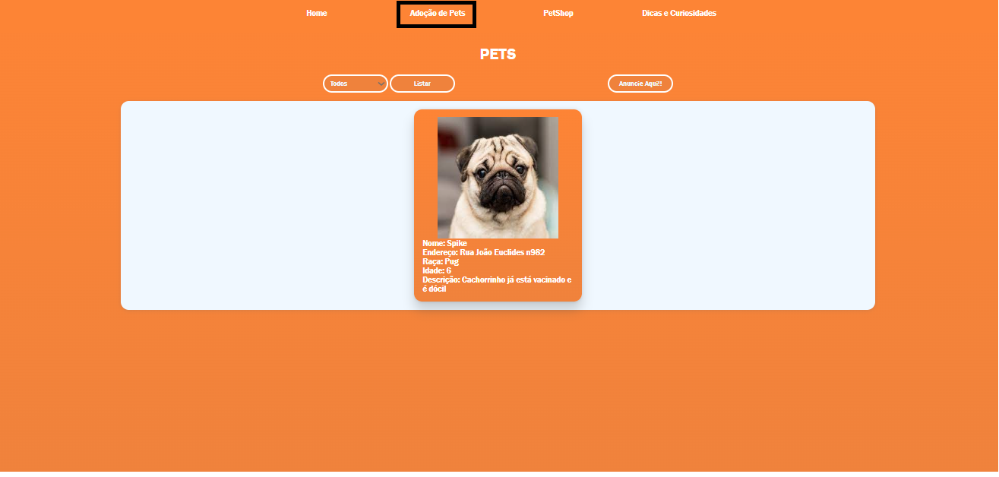
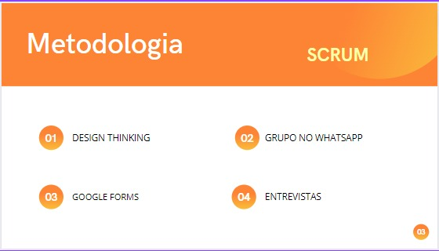

# Informações do Projeto
`ADOTZ`  

Nos dias atuais, é muito veiculado em redes sociais mensagens perguntando acerca de pessoas aptas a adotar um animal. Dito isso, a dor que estamos focados em solucionar é a forma de se adotar um Pet, problema tal está geralmente atrelado as maneiras mais convencionais de como isso atualmente funciona, como por exemplo canis, clínicas veterinárias e também Petshops, maneiras nada eficientes comparadas a plataforma que desenvolvemos.

`TIAW - Ciência da Computação` 

Criada durante o trabalho da materia de TIAW(Trabalho Interdisciplinar de Aplicações Web) do curso de Ciência da Computação da PUC Minas. A Adotz é um projeto que busca auxiliar pessoas na hora de adotar um pet. Dentro do nosso site você encontrará, uma aba com varias opções de Pets para se adotar, diversas opções de petshops para cuidar dos seus pets e uma pagina recheada com dicas e curiosidades para o melhor cuidado do seu amiguinho.

## Participantes

* Felipe Luiz Parreiras Lima
* Daniel de Moura Renda
* Luiz Felipe Ferreira De Lacerda
* Pedro Melo Menezes
* Ian Carlos Santos da Gama
* Matheus Cleto Paes
* Gabriel Lopes Messias

# Estrutura do Documento

- [Informações do Projeto](#informações-do-projeto)
  - [Participantes](#participantes)
- [Estrutura do Documento](#estrutura-do-documento)
- [Introdução](#introdução)
  - [Problema](#problema)
  - [Objetivos](#objetivos)
  - [Justificativa](#justificativa)
  - [Público-Alvo](#público-alvo)
- [Especificações do Projeto](#especificações-do-projeto)
  - [Personas e Mapas de Empatia](#personas-e-mapas-de-empatia)
  - [Histórias de Usuários](#histórias-de-usuários)
  - [Requisitos](#requisitos)
    - [Requisitos Funcionais](#requisitos-funcionais)
    - [Requisitos não Funcionais](#requisitos-não-funcionais)
  - [Restrições](#restrições)
- [Projeto de Interface](#projeto-de-interface)
  - [User Flow](#user-flow)
  - [Wireframes](#wireframes)
- [Metodologia](#metodologia)
  - [Divisão de Papéis](#divisão-de-papéis)
  - [Ferramentas](#ferramentas)
  - [Controle de Versão](#controle-de-versão)
- [**############## SPRINT 1 ACABA AQUI #############**](#-sprint-1-acaba-aqui-)
- [Projeto da Solução](#projeto-da-solução)
  - [Tecnologias Utilizadas](#tecnologias-utilizadas)
  - [Arquitetura da solução](#arquitetura-da-solução)
- [Avaliação da Aplicação](#avaliação-da-aplicação)
  - [Plano de Testes](#plano-de-testes)
  - [Ferramentas de Testes (Opcional)](#ferramentas-de-testes-opcional)
  - [Registros de Testes](#registros-de-testes)
- [Referências](#referências)

# Introdução

## Problema

A dor que buscamos resolver, com o desenvolvimento do site, é a falta de meios para se realizar a adoção de um pet, como por exemplo, sites ou aplicativos. As vezes 
essas aplicações existem, porém não trazem um experiência agradável ao usuário. Atrelado a isso, um outro problema que surge decorrente da falta de adoção de animais, 
é a superlotação de canis, ou ong's que abrigam esses animais. 

**Links úteis que apresentam informações relevantes sobre o assunto**:
 
>[Abandono de animais e superlotação do canil causam preocupação em São Leopoldo](https://www.jornalvs.com.br/noticias/regiao/2022/06/29/abandono-de-animais-e-superlotacao-do-canil-causam-preocupacao-em-sao-leopoldo.html)
>  
>[Deficiência como sentença: cães esperam há anos por adoção no DF](https://www.metropoles.com/distrito-federal/deficiencia-como-sentenca-caes-esperam-adocao-no-df)
> 
>[Superlotação preocupa ONGs que cuidam de animais no ABC](http://www.metodista.br/rronline/noticias/cidades/2011/08/superlotacao-preocupa-ongs-que-cuidam-de-animais-no-abc)

## Objetivos

Nosso principal objetivo com o desenvolvimento do site Adotz, é justamente apresentar um solução para essa dor relacionada à adoção de Pets. Por isso, focamos nossos esforços para criar uma aplicação chamativa, agradável ao usuário e extremamente funcional, onde o usuário pode cadastrar Petshops, anunciar Pets disponíveis para adoção, editar informações já publicadas. Além disso conta com um portal de dicas e curiosidades, que são cadastrados por usuários da plataforma.

## Justificativa

A principal motivação para termos escolhidos o tema, é que grande parte dos membros do grupo são apaixonados por animais/pets, consequentemente nos importamos com os diversos Pets que infelizmente vivem em situação de abandono e também que estão em canis a espera de um novo lar, que possa fornecem carinho e amor ao bichos. Por isso, nossa aplicação se baseia na listagem de pets disponíveis para adoção, ou seja, um canil, petshop, ou terceiro se encarrega de publicar o animal e um outro usuário com o interesse no bichinho, entra em contato com quem publicou e o adota.

## Público-Alvo

Uma forma viável de apresentar nosso público-alvo e também o SteakHolders, seria com uma divisão em 3 grupos, são eles: os "Fundamentais", os "Importantes" e os "Influenciadores".
Primeiramente, no grupo de fundamentais, estão as pessoas que irão adotas, os canis e os petshops, que irão publicar os pets, ou então divulgar seus petshops.
Segundamente, no grupo de importantes, estão os veteriários, que tratrão dos animais antes de serem adotados.
Terceiramente, no grupo dos infulenciadores, estão os adestradores, que de forma implícita fazem parte do ecossistema, ou seja, adestram os bichinhos antes mesmo, ou então posteriormente a adoção.
 
# Especificações do Projeto

O grupo "adoção de pets" tem como finalidade criar um site focado em adoção e compra de animais, com um foco maior na adoção, já que é um problema que aflige diversos 
animais em situações de rua e resgatados. De acordo com as pesquisas realizadas por nós, descobrimos que pessoas que não possuem um pet ainda, tem a tendência de 
querer um para lhe fazer companhia e diversificar a rotina. Além disso, existem aqueles que gostam avidamente desses seres e gostam de ter diversos bichos por perto. 
Desta forma, escolhemos esse tema pela falta de ferramentas de pesquisa disponíveis online, com um foco maior no público jovem-adulto, que faz um maior uso da internet 
para se informar.

## Personas e Mapas de Empatia

**Exemplo de Persona**

## Histórias de Usuários

Com base na análise das personas forma identificadas as seguintes histórias de usuários:

|EU COMO... `PERSONA`| QUERO/PRECISO ... `FUNCIONALIDADE` |PARA ... `MOTIVO/VALOR`                 |
|--------------------|------------------------------------|----------------------------------------|
|Usuário do sistema  | Cadastrar Pets e Petshops           | Que o pet seja adotado.            |
|Usuário do sistema   | Ver pets cadastrados                | Adotar um pet já cadastrado |

Pelo fato de ainda não termos validado nosso produto publicamente, ainda não temos histórias de usuários do site.

## Requisitos

As tabelas que se seguem apresentam os requisitos funcionais e não funcionais que detalham o escopo do projeto.

### Requisitos Funcionais

|ID    | Descrição do Requisito  | Prioridade |
|------|-----------------------------------------|----|
|RF-001| Permitir que o usuário cadastre Petshops | ALTA | 
|RF-002| Permitir que o usuário cadastre Pets   | ALTA |
|RF-003| Permitir que o usuário cadastre Dicas e Curiosidades  | ALTA |
|RF-004| Permitir que o usuário efetue login | BAIXA | 
|RF-005| Permitir que o usuário visualize informações cadastradas   | ALTA |
|RF-006| Permitir que o usuário edite informações cadastradas   | MÉDIA |
|RF-007| Permitir que o usuário delte informações cadastradas   | ALTA |

### Requisitos não Funcionais

|ID     | Descrição do Requisito  |Prioridade |
|-------|-------------------------|----|
|RNF-001| O sistema deve ser responsivo para rodar em um dispositivos móvel | MÉDIA | 
|RNF-002| Permitir a visualização da informação cadastrada imediatamente |  ALTA | 

## Restrições

O projeto está restrito pelos itens apresentados na tabela a seguir.

|ID| Restrição                                             |
|--|-------------------------------------------------------|
|01| O projeto deverá ser entregue até o final do semestre |
|02| Não pode ser desenvolvido um módulo de backend        |

# Projeto de Interface

As interfaces foram projetadas apartir de necessidades, que foram colhidas de possível usuários através de pesquisas por formulário.

## User Flow / WireFrames

O User Flow abaixo será apresenta de forma sequencial, onde cada print representará 

# Metodologia

## Divisão de Papéis

......  COLOQUE AQUI O SEU TEXTO ......

> Apresente a divisão de papéis e tarefas entre os membros do grupo.
>
> **Links Úteis**:
> - [11 Passos Essenciais para Implantar Scrum no seu Projeto](https://mindmaster.com.br/scrum-11-passos/)
> - [Scrum em 9 minutos](https://www.youtube.com/watch?v=XfvQWnRgxG0)

## Ferramentas

......  COLOQUE AQUI O SEU TEXTO - SIGA O EXEMPLO DA TABELA ABAIXO  ......

| Ambiente  | Plataforma              |Link de Acesso |
|-----------|-------------------------|---------------|
|Processo de Design Thinkgin  | Miro |  https://miro.com/XXXXXXX | 
|Repositório de código | GitHub | https://github.com/XXXXXXX | 
|Hospedagem do site | Heroku |  https://XXXXXXX.herokuapp.com | 
|Protótipo Interativo | MavelApp ou Figma | https://figma.com/XXXXXXX | 

>
> Liste as ferramentas empregadas no desenvolvimento do
> projeto, justificando a escolha delas, sempre que possível.
> 
> As ferramentas empregadas no projeto são:
> 
> - Editor de código.
> - Ferramentas de comunicação
> - Ferramentas de diagramação
> - Plataforma de hospedagem
> 
> O editor de código foi escolhido porque ele possui uma integração com o
> sistema de versão. As ferramentas de comunicação utilizadas possuem
> integração semelhante e por isso foram selecionadas. Por fim, para criar
> diagramas utilizamos essa ferramenta por melhor captar as
> necessidades da nossa solução.
> 
> **Links Úteis - Hospedagem**:
> - [Getting Started with Heroku](https://devcenter.heroku.com/start)
> - [Crie seu Site com o HostGator](https://www.hostgator.com.br/como-publicar-seu-site)
> - [GoDady](https://br.godaddy.com/how-to)
> - [GitHub Pages](https://pages.github.com/)

## Controle de Versão

......  COLOQUE AQUI O SEU TEXTO ......

> Discuta como a configuração do projeto foi feita na ferramenta de
> versionamento escolhida. Exponha como a gerência de tags, merges,
> commits e branchs é realizada. Discuta como a gerência de issues foi
> realizada.
> A ferramenta de controle de versão adotada no projeto foi o
> [Git](https://git-scm.com/), sendo que o [Github](https://github.com)
> foi utilizado para hospedagem do repositório `upstream`.
> 
> O projeto segue a seguinte convenção para o nome de branchs:
> 
> - `master`: versão estável já testada do software
> - `unstable`: versão já testada do software, porém instável
> - `testing`: versão em testes do software
> - `dev`: versão de desenvolvimento do software
> 
> Quanto à gerência de issues, o projeto adota a seguinte convenção para
> etiquetas:
> 
> - `bugfix`: uma funcionalidade encontra-se com problemas
> - `enhancement`: uma funcionalidade precisa ser melhorada
> - `feature`: uma nova funcionalidade precisa ser introduzida
>
> **Links Úteis**:
> - [Tutorial GitHub](https://guides.github.com/activities/hello-world/)
> - [Git e Github](https://www.youtube.com/playlist?list=PLHz_AreHm4dm7ZULPAmadvNhH6vk9oNZA)
> - [5 Git Workflows & Branching Strategy to deliver better code](https://zepel.io/blog/5-git-workflows-to-improve-development/)
>
> **Exemplo - GitHub Feature Branch Workflow**:
>
> 

# **############## SPRINT 1 ACABA AQUI #############**

# Projeto da Solução

......  COLOQUE AQUI O SEU TEXTO ......

## Tecnologias Utilizadas

......  COLOQUE AQUI O SEU TEXTO ......

> Descreva aqui qual(is) tecnologias você vai usar para resolver o seu
> problema, ou seja, implementar a sua solução. Liste todas as
> tecnologias envolvidas, linguagens a serem utilizadas, serviços web,
> frameworks, bibliotecas, IDEs de desenvolvimento, e ferramentas.
> Apresente também uma figura explicando como as tecnologias estão
> relacionadas ou como uma interação do usuário com o sistema vai ser
> conduzida, por onde ela passa até retornar uma resposta ao usuário.
> 
> Inclua os diagramas de User Flow, esboços criados pelo grupo
> (stoyboards), além dos protótipos de telas (wireframes). Descreva cada
> item textualmente comentando e complementando o que está apresentado
> nas imagens.

## Arquitetura da solução

......  COLOQUE AQUI O SEU TEXTO E O DIAGRAMA DE ARQUITETURA .......

> Inclua um diagrama da solução e descreva os módulos e as tecnologias
> que fazem parte da solução. Discorra sobre o diagrama.
> 
> **Exemplo do diagrama de Arquitetura**:
> 
> 

# Avaliação da Aplicação

......  COLOQUE AQUI O SEU TEXTO ......

> Apresente os cenários de testes utilizados na realização dos testes da
> sua aplicação. Escolha cenários de testes que demonstrem os requisitos
> sendo satisfeitos.

## Plano de Testes

......  COLOQUE AQUI O SEU TEXTO ......

> Enumere quais cenários de testes foram selecionados para teste. Neste
> tópico o grupo deve detalhar quais funcionalidades avaliadas, o grupo
> de usuários que foi escolhido para participar do teste e as
> ferramentas utilizadas.
> 
> **Links Úteis**:
> - [IBM - Criação e Geração de Planos de Teste](https://www.ibm.com/developerworks/br/local/rational/criacao_geracao_planos_testes_software/index.html)
> - [Práticas e Técnicas de Testes Ágeis](http://assiste.serpro.gov.br/serproagil/Apresenta/slides.pdf)
> -  [Teste de Software: Conceitos e tipos de testes](https://blog.onedaytesting.com.br/teste-de-software/)

## Ferramentas de Testes (Opcional)

......  COLOQUE AQUI O SEU TEXTO ......

> Comente sobre as ferramentas de testes utilizadas.
> 
> **Links Úteis**:
> - [Ferramentas de Test para Java Script](https://geekflare.com/javascript-unit-testing/)
> - [UX Tools](https://uxdesign.cc/ux-user-research-and-user-testing-tools-2d339d379dc7)

## Registros de Testes

......  COLOQUE AQUI O SEU TEXTO ......

> Discorra sobre os resultados do teste. Ressaltando pontos fortes e
> fracos identificados na solução. Comente como o grupo pretende atacar
> esses pontos nas próximas iterações. Apresente as falhas detectadas e
> as melhorias geradas a partir dos resultados obtidos nos testes.

# Referências

......  COLOQUE AQUI O SEU TEXTO ......

> Inclua todas as referências (livros, artigos, sites, etc) utilizados
> no desenvolvimento do trabalho.
> 
> **Links Úteis**:
> - [Formato ABNT](https://www.normastecnicas.com/abnt/trabalhos-academicos/referencias/)
> - [Referências Bibliográficas da ABNT](https://comunidade.rockcontent.com/referencia-bibliografica-abnt/)
